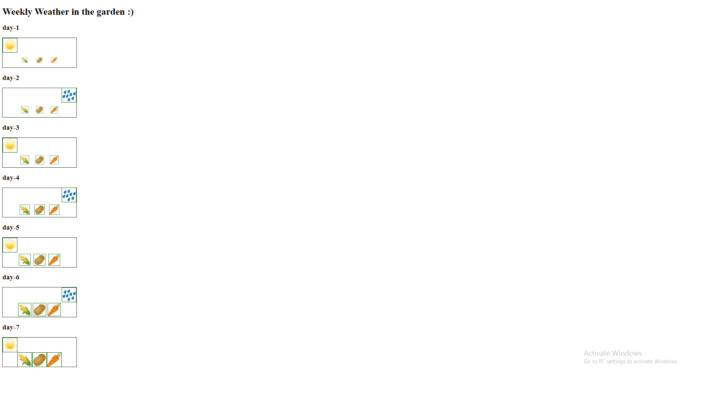

## Selectorii in CSS. Selectorii descendentilor (mostenitorilor)

> Atunci cand nu se cunoaste exact unde se afla un descendent pe teritoriul unui element parinte (de baza), dar se cunoaste faptul ca acesta se include in interiorul elementului de baza, poate fi utilizat selectorul descententului. Formula acestuia este simpla, incepe de la selectorul "teritoriului" unde se face cautarea si continua separat prin SPATIU cu selectorii care "specifica" unde si ce trebuie cautat.

> Pseudo selectorul ```:nth-child(...) { ... }``` poate fi utilizat pentru a selecta un element numarul caruia este indicat in loc de ```...``` sau poate fi utilizat pentru a indica o formula gen ```odd``` - elemente impare sau ```even``` toate elementele pare. La fel poate fi completat cu formule matematice gen ```2n+3```  - fiecare al doilea element, incepand cu al 3-lea din lista copiilor.

> Selectorul care grupeaza ```selector1, selector2, selector3 { ... }``` poate fi utilizat pentru a grupa mai multe elemente sub acelasi stil.


* Urmatorul fragment de cod [index](./index.html) reprezinta o gradina cu 3 parcele de legume si cu 7 starea vremii pentru 7 zile ale unei saptamani. Deschideti fisierul si dati o privire la cod si la rezultatul initial, fara modificari.
* Se cere sa:
  * Continuati codul in CSS incepand cu ```/* ??? */``` utilizand selectorul descendent, de grupare, pseudoselectorii gen ```nth-....``` si proprietatile ```margin,float,transform``` astfel incat sa obtineti cele 7 zile in felul urmator: 
    
          

  * Dupa ce ati obtinut rezultatul raspundeti la intrebarea:
    * Ce rol semantic joaca elementul ```<main>``` ?
    * Au fost bine amplasate din punct de vedere semantic ```<h1>``` si ```<h2>``` ?
