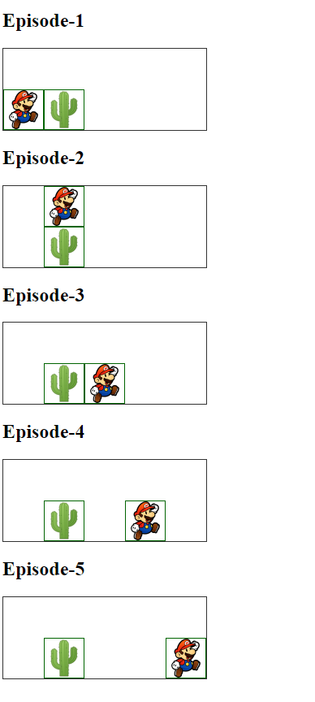

## Selectorii in CSS. Selectorii descendentilor (mostenitorilor)

> Atunci cand nu se cunoaste exact unde se afla un descendent pe teritoriul unui element parinte (de baza), dar se cunoaste faptul ca acesta se include in interiorul elementului de baza, poate fi utilizat selectorul descententului. Formula acestuia este simpla, incepe de la selectorul "teritoriului" unde se face cautarea si continua separat prin SPATIU cu selectorii care "specifica" unde si ce trebuie cautat.

* De exemplu, daca am dori sa gasim toate referintele din "header" am scrie ```header a { ... }```

* Urmatorul fragment de cod [index](./index.html) reprezinta in 5 secvente miscarea lui "Mario" pe o harta. Deschideti fisierul si dati o privire la cod si la rezultatul initial, fara modificari.
* Se cere sa:
  * In comentarii CSS raspundeti la intrebarile:
    1. Descifrati selectorul ```section .mario, section .cactus { ... } ``` 
    2. Ce reprezinta ```float: left``` si ce s-ar fi schimbat daca era utilizata valoarea ```right```?
    3. Ce efect are ```margin-top``` ? ce s-ar schimba in caz de valoare negativa ?
    4. Ce dimensiune (cu tot cu border) au patratele din interiorul containerul ```section```?
  * Continuati codul in CSS incepand cu ```/* ??? */``` utilizand selectorul descendent si proprietatea ```margin``` astfel incat sa obtineti cele 5 epizoade in felul urmator
        

  * Dupa ce ati obtinut rezultatul raspundeti la intrebarea:
    * De ce ```cactusul``` se deplaseaza odata cu ```mario```
  * Executati acelasi exercitiu, repetat, cu exact acelasi rezultat vizual, dar incepand cu starea initiala ```float: right```  