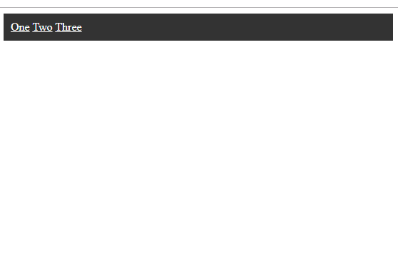

## Utilizarea "webpack"

> Webpack este un set de tool-uri moderte destinate optimizarii procesului de development si asamblare pentru lansarea diferitor tipuri de aplicatii web si nu doar web.


---

* In acest exemplu va trebui sa asamblati un bundle care contine javascript, stiluri si un mic fragment de HTML pentru o componenta de tip "navbar" (bara de navigare), pentru Frontend.


* Ca sa realizati aceasta clonati structura [acestui folder](./) si urmati pasii:
 
1. INSTALAREA.  Instalati webpack-ul si urmatoarele extensii pentru webpack: 
     1.  html-loader
     2.  css-loader
     3.  style-loader 
     * De obicei in webpack "load"-erele reprezinta niste adaptoare care pot incarca un anumit format de fisiere si il pot impacheta in codul final. Aceste extensii sunt necesare pentru regimul **dev**
      
2. CONFIGURAREA. Verificati ca fisierul de configurare "webpack.config.js" sa corespunda proiectului prin:
   1. ```entry: './src/navbar/navbar.js'```  sa inidice calea spre fisierul principal 
   2. ```output: { ... }``` sa indice corect calea si denumirea unde se va amplasa rezultatul final
   3. Vom adauga inca o sectiune de configurare mai jos de **output** cu denumirea **module** in obiectul configurarii 
 
    ```js
        module: {
            rules: [
                {
                    test: /\.css$/i,
                    use: ['style-loader', 'css-loader'],
                },
                {
                    test: /\.html$/,
                    use: [{
                        loader: 'html-loader',
                        options: {
                            minimize: true
                        }
                    }],
                }
            ],
        }
    ```
    aceasta sectiune a fost alcatuita in baza documentatiei celor cateva "load"-ere de CSS si HTML. Daca observati **rules** contine reguli care determina print "test" un anumit set de fisiere si aplica un anumit loader pentru a le procesa. Daca observati in cazul **css** sunt actiunate doua componente 'style-loader' si 'css-loader' din ce cauza - style-loader va incarca automat stilurile in domunentul final prin Javascript, css-loader - e doar un incarcator de format (poate fi si scss-loader si stylus, etc). In cazul incarcarii **html** observati optiunea de "minimizare" - pentru a compresa codul html.

3. CONFIGURAREA. Adaugam un nou script de rulare pentru **npm** in **package.json** in sectiunea "scripts" 
   ```  "build": "webpack --config webpack.config.js" ``` 
   ca sa nu rulam manual aceasta comanda. 

4. ASAMBLAREA. Rulam ```npm run build``` daca totul este ok, in **dist** va aparea **bundle.js**, acest fisier deja contine toate asset-urile integrate (css-ul, html-ul, etc...)

5. TESTAREA REZULTATULUI. Pentru a verifica daca totul functioneaza corect rulati in browser **index.html**. Rezultatul ar trebui sa arate asa
     

6. Uitati-va in **src/navbar/navbar.js** si incercati sa explicati ce face script-ul din aceasta componenta ?

